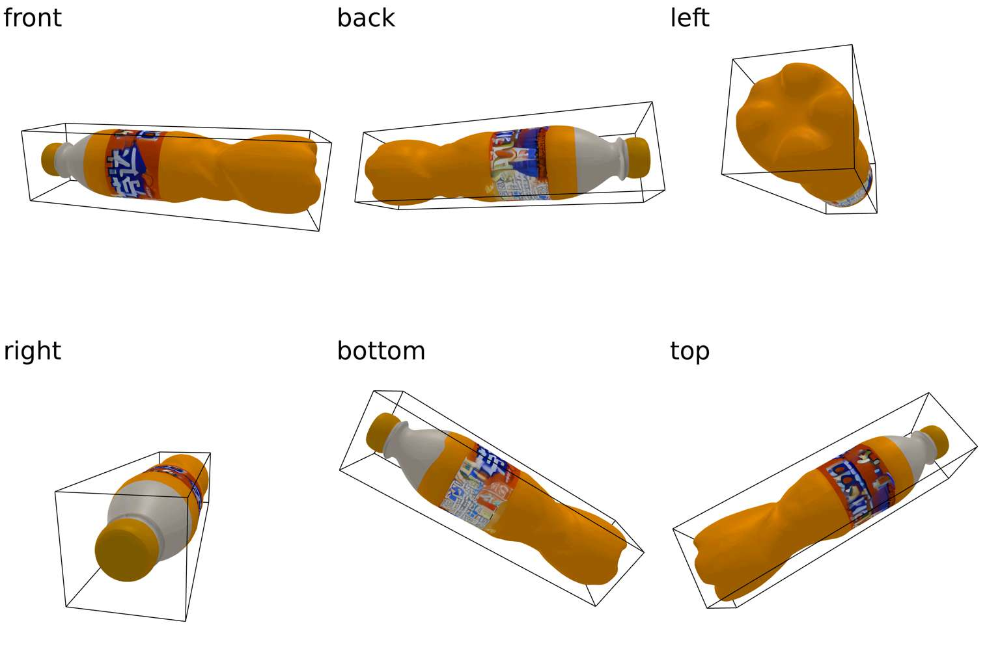
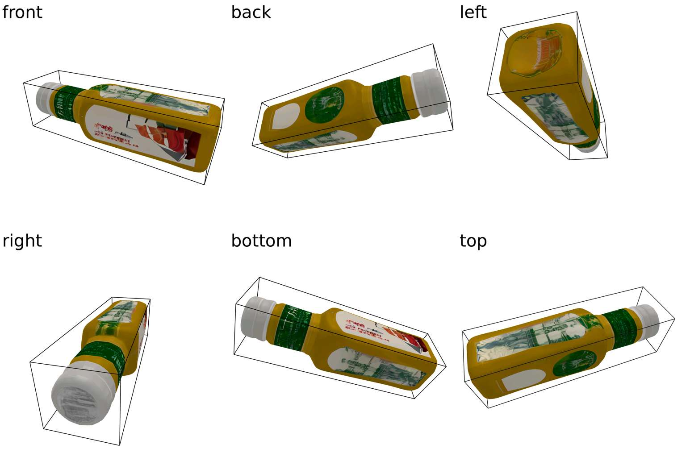
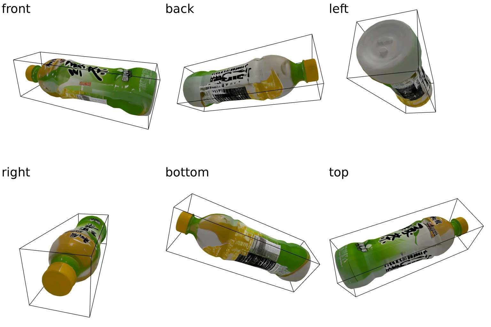
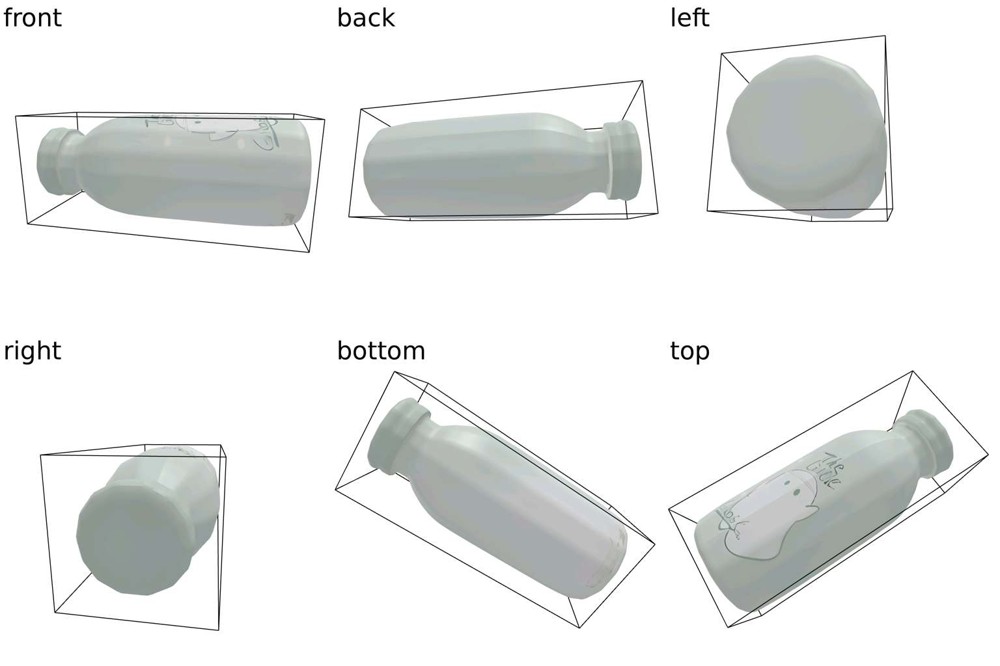

<!DOCTYPE html>
<html lang="en">
<body>
    

        

                

             

                
                
base0

            

                 

                
                
base1

            

                

            

             

                
                
base2

            

                 

                
                
base3

            

                

            

             

                
                
base4

            

                 

                
                
base5

            

                

            

             

                
                
base6

            

                 

                
                
base7

            

                

            

             

                
                
base8

            

                 

                
                
base9

            

                

            

             

                
                
base10

            

                 

                
                
base11

            

                

            

             

                
                
base12

            

                 

                
                
base13

            

                

            

             

                
                
base14

            

                 

                
                
base15

            

                

            

             

                
                
base16

            

                 

                
                
base17

            

                

            

             

                
                
base18

            

                 

                
                
base19

            

                

            

             

                
                
base20

            

                 

                
                
base21

            

                

            

             

                
                
base22

            

               

  

</body>
</html>
