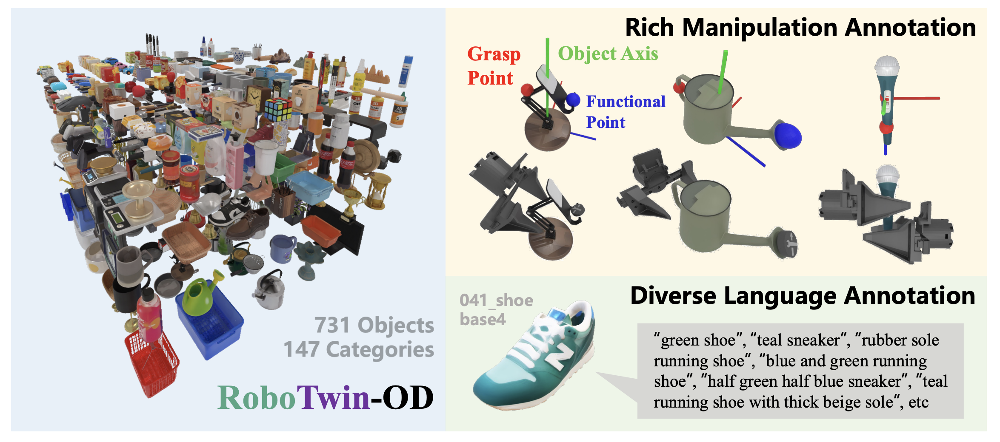

# RoboTwin-OD (RoboTwin Object Dataset)

This is a document containing images and ID information for all objects in RoboTwin-OD, excluding those from the Objaverse dataset.

To enhance both manipulation capability and visual understanding, we construct a large-scale object dataset with rich semantic annotations, called <b>RoboTwin-OD</b>, covering 147 categories and 731 diverse objects. Specifically, this includes 534 instances across 111 categories with custom-generated and optimized meshes, 153 objects from 27 categories in Objaverse, and 44 articulated object instances from 9 categories in SAPIEN PartNet-Mobility. Objects from all sources, including Objaverse, are used for cluttered scene construction, with Objaverse specifically serving to further increase the visual and semantic diversity of distractor objects. Additionally, we develop a comprehensive surface and background texture library using generative AI and human-in-the-loop verification to ensure both diversity and realism. The dataset is available at <a href="https://huggingface.co/datasets/TianxingChen/RoboTwin2.0/tree/main/objects">https://huggingface.co/datasets/TianxingChen/RoboTwin2.0/tree/main/objects</a>.