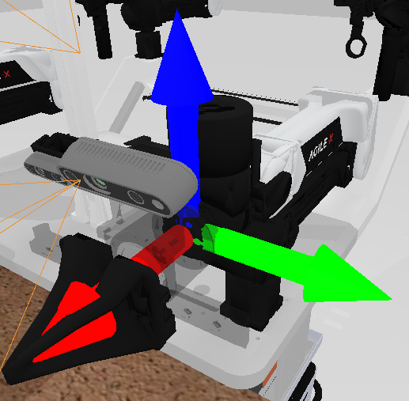

# Configuration Tutorial

All configuration files are stored in the `task_config` folder and follow the standard YAML format.

You can run `bash task_config/create_task_config.sh ${task_config_name}` to create new task configuration.

## ✅ Minimal Example

**An episode's data will be stored in one HDF5 file. Specifically, the images will be stored as bit streams. If you want to recover the image, you can use the following code:**

```
image = cv2.imdecode(np.frombuffer(image_bit, np.uint8), cv2.IMREAD_COLOR)
```

Below is a minimal configuration file to start a typical data collection session:

```yaml
render_freq: 0
episode_num: 100
use_seed: false
save_freq: 15
embodiment:
  - aloha-agilex
language_num: 100

domain_randomization:
  random_background: true
  cluttered_table: true
  clean_background_rate: 0.02
  random_head_camera_dis: 0
  random_table_height: 0.03
  random_light: true
  crazy_random_light_rate: 0.02
  random_embodiment: false

camera:
  head_camera_type: D435
  wrist_camera_type: D435
  collect_head_camera: true
  collect_wrist_camera: true

data_type:
  rgb: true
  third_view: false
  depth: false
  pointcloud: false
  observer: false
  endpose: false
  qpos: true
  mesh_segmentation: false
  actor_segmentation: false

pcd_down_sample_num: 1024
pcd_crop: true
dual_arm: true
save_path: ./data
clear_cache_freq: 5
collect_data: true
eval_video_log: true
```

---

## 🔧 Configuration Breakdown

### 🎯 Task & Embodiment Settings

| Field          | Type | Required | Description                                                                                                                                               |
|----------------|------|----------|-----------------------------------------------------------------------------------------------------------------------------------------------------------|
| `embodiment`   | list | ✅        | List of robot embodiment(s). For a dual-arm robot, use `[name]`, e.g., `[aloha-agilex]`; to combine two single-arm robots, use `[left, right, interval]`, e.g., `embodiment: [piper, franka-panda, 0.6]`, `embodiment: [franka-panda, franka-panda, 0.8]`. The `interval` specifies the distance between arms (typically 0.6–0.8 meters). Available Embodiment: `ur5-wsg`, `ARX-X5`, `franka-panda`, `piper`, `aloha-agilex`(dual-arm) |
| `dual_arm`     | bool | optional | Whether to use both arms. Default: `true`.                                                                                                                |
| `use_seed`     | bool | ✅        | Whether to use a predefined seed list from `data/${task_name}/${task_config}/seed.txt`. If `false`, the system will automatically explore viable seeds.                         |
| `episode_num`  | int  | ✅        | Number of **successful episodes** to collect.                                                                                                             |
| `language_num` | int  | optional | If using language-conditioned task planning, sets the number of language descriptions to sample for each task.                                            |

### 🧠 Domain Randomization

Configure task variation for better generalization.

```yaml
domain_randomization:
  random_background: true
  cluttered_table: true
  clean_background_rate: 0.02
  random_head_camera_dis: 0
  random_table_height: 0.03
  random_light: true
  crazy_random_light_rate: 0.02
  random_embodiment: false
```

| Field                     | Type  | Description                                                                                      |
| ------------------------- | ----- | ------------------------------------------------------------------------------------------------ |
| `random_background`       | bool  | Enable random textures for the table and background.                                             |
| `cluttered_table`         | bool  | Add distractor objects to the table to simulate a cluttered environment.                         |
| `clean_background_rate`   | float | Ratio of clean backgrounds (e.g., `0.02` = 2%). Only effective if `random_background` is `true`. |
| `random_head_camera_dis`  | float | Random displacement applied to the head camera position (in meters).                             |
| `random_table_height`     | float | Random variation in the table height (in meters).                                                |
| `random_light`            | bool  | Enable randomized lighting during simulation.                                                    |
| `crazy_random_light_rate` | float | Probability of applying extreme lighting. Only effective if `random_light` is `true`.            |
| `random_embodiment`       | bool  | Enable embodiment randomization (experimental, currently not fully supported).                   |


### 📷 Camera Configuration

```yaml
camera:
  head_camera_type: D435
  wrist_camera_type: D435
  collect_head_camera: true
  collect_wrist_camera: true
```

| Field                  | Type | Description                                                                        |
| ---------------------- | ---- | ---------------------------------------------------------------------------------- |
| `head_camera_type`     | str  | Camera used for global observation. Options: see `task_config/_camera_config.yml`. |
| `wrist_camera_type`    | str  | Camera used for close-up view.                                                     |
| `collect_head_camera`  | bool | Whether to collect head-view data.                                                 |
| `collect_wrist_camera` | bool | Whether to collect wrist-view data.                                                |

---

### 📦 Data Collection Settings

| Field              | Type | Description                                                                                                                                                                                                                                                                                                  |
|--------------------|------|--------------------------------------------------------------------------------------------------------------------------------------------------------------------------------------------------------------------------------------------------------------------------------------------------------------|
| `collect_data`     | bool | Enable actual data saving.                                                                                                                                                                                                                                                                                  |
| `save_freq`        | int  | Save every N steps. Per-step indicates 0.004s in the real world.                                                                                                                                                                                                                                                                                         |
| `save_path`        | str  | Directory to save data. Default: `./data`.                                                                                                                                                                                                                                                                  |
| `clear_cache_freq` | int  | <span style="color:red">Controls the frequency (in episodes) at which the Sapien scene cache is cleared. This helps manage GPU memory usage, especially when domain randomization is enabled and many diverse assets accumulate in memory. A smaller value (e.g., 1) increases clearing frequency but incurs additional time cost.</span> |
| `eval_video_log`   | bool | Save evaluation videos for replay.                                                                                                                                                                                                                                                                          |


---

### 💾 Data Type

Specify which data to collect in each episode:

```yaml
data_type:
  rgb: true
  third_view: false
  depth: false
  pointcloud: false
  observer: false
  endpose: false
  qpos: true
  mesh_segmentation: false
  actor_segmentation: false
```

| Type                 | Description                        |
| -------------------- | ---------------------------------- |
| `rgb`                | RGB image from multiple views.     |
| `third_view`         | Third-person video.                |
| `depth`              | Depth images from cameras (mm).         |
| `pointcloud`         | Merged point cloud of the scene.   |
| `observer`           | Observer-view RGB frame.           |
| `endpose`            | End-effector pose and gripper opening ratio.              |
| `qpos`               | Robot joint angles.                |
| `mesh_segmentation`  | Per-object segmentation from mesh. |
| `actor_segmentation` | Per-actor segmentation from RGB.   |

##### Note
- `endpose` will get an dict containing `left_endpose`, `left_gripper`, `right_endpose` and `right_gripper`. The `left_endpose` and `right_endpose` are list of 7 elements represent the position in world and orientation of the  end-effectors, following the order `x, y, z, qw, qx, qy, qz`. And the `left_gripper` and `right_gripper` are float numbers, which repersent the opening ratio of the gripper, ranging from 0 to 1. The rotation of end-effector is as the image below: for all embodiments, the end-effector rotation is consistent, with the x-axis pointing across the gripper and the z-axis pointing across the camera.


---

### 🔍 Point Cloud Settings

| Field                 | Type | Description                                                       |
| --------------------- | ---- | ----------------------------------------------------------------- |
| `pcd_down_sample_num` | int  | FPS (Farthest Point Sampling) number; set `0` to keep all points. |
| `pcd_crop`            | bool | Whether to crop out table/walls based on known transforms.        |

---

### 🎥 Rendering

| Field         | Type | Description                                                                                            |
| ------------- | ---- | ------------------------------------------------------------------------------------------------------ |
| `render_freq` | int  | Render visualization every N steps. Set to `0` to disable. For servers without display, recommend `0`. If you want to visualize the task, try to modify it to `20` (as example) |

---

## 📌 Notes

* All task names must correspond to files in `env/<task_name>.py`.
* For available embodiments and cameras, refer to:

  * `task_config/_embodiment_config.yml`
  * `task_config/_camera_config.yml`
* The system supports both dual-arm and single-arm setups.
* Seeds, if used, are located in `task_config/seeds/`.

