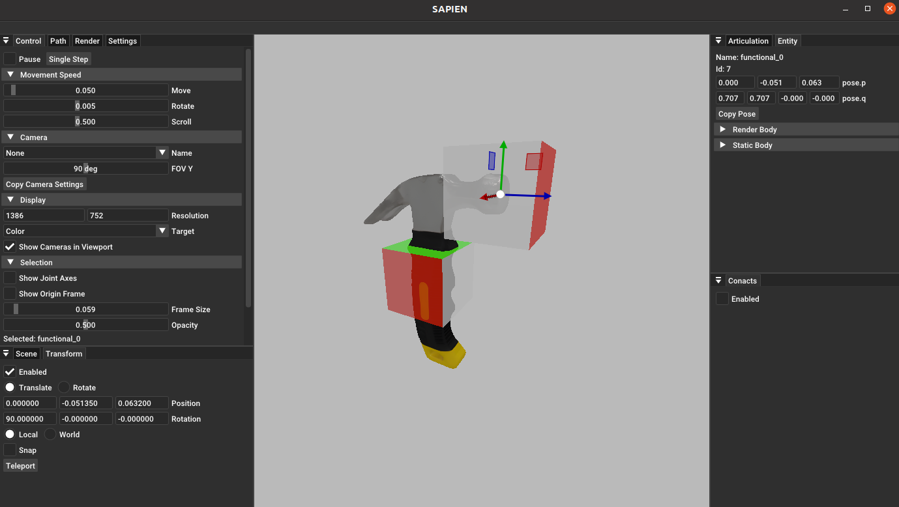

# Calibration Tool Instructions

## Rigid Body Object Annotation
### Create Calibration Window:
```bash
python script/create_object_data.py [-s START] model_name

positional arguments:
    model_name            Model name

options:
    -s START, --start START Start id
```
Here, `model_name` is the name of a subdirectory under the `assets/objects/` directory.
For example, to calibrate the hammer model located at `assets/objects/020_hammer`, run the command:
`python script/create_object_data.py 020_hammer`.
A window will then appear as shown below:


### Calibration Commands:
```
resize:
    Usage:
        resize <x_size> <y_size> <z_size>: Set scaling along x, y, z axes
        resize <size>: Uniformly scale all three axes
    Example:
        resize 0.1
create:
    Usage:
        create <type>: Create (t)arget, (c)ontact, (f)unctional, or (o)rientation point
        create: Waits for input of point name
    Examples:
        create t
        create f
clone:
    Usage:
        clone <type> <id>: Clone a specified type and ID point in place
        clone: Waits for input of point type and ID
    Examples:
        clone t 1: Clones contact point target_1 to create a new target point (e.g., target_2)
rotate:
    Usage:
        rotate <id> <axis> <interval>: Rotate a specified contact point around its own axis by a given interval, generating points belonging to the same group
    Example:
        rotate 1 x 90: Rotates contact_1 around its x-axis every 90 degrees, creating three additional contact points, and writes the group into concat_points_group
align:
    Usage:
        align: Aligns all group points' positions to the first point in the group
remove:
    Usage:
        remove <type> <id>: Removes a point with the specified name
        remove: Waits for input of point name
    Examples:
        remove t 0
save:
    Saves current calibration data — always remember to save!
exit:
    Exits the calibration window
```
As an example using `020_hammer`, entering `create c` creates a cube centered on the object. Use your mouse to select this cube and check "Enable" under the Transform section in the UI window. Then choose "Local" to display the cube's center position and coordinate system, which represents the contact point's location and orientation:


You can move the calibration point's position with the mouse. Click on "Rotate" in the Transform options to adjust the rotation along the x, y, and z axes, changing the point's coordinate system orientation:


Next, add a functional point to the head of the hammer, adjust its orientation, and use the command `create f` to move it to the center position of the hammer head. The adjusted point is shown in the following image:


Finally, enter `save` to save the point information, and then enter `exit` to end the calibration.

Notes :

1. After adjusting the position, you must click "Teleport" under the Transform menu to apply the movement.
2. Always remember to save your changes before exiting the calibration window!

### View Calibration Files
Navigate to the asset folder you just calibrated, and you will find a newly generated `model_data{id}.json` file. You can modify the `"scale"` field within this file to adjust the asset's scaling in the simulation environment.


The meanings of each field in the asset can be found in the [model_data_info](object_marking/model_data_info.md) file.


## URDF Articulation Objects Annotation
### Create Calibration Window:
Similar to rigid body object annotation, use the same command to create the articulation calibration window. The calibration program will automatically recognize the asset type.

### Calibration Commands:
```
run:
    Usage:
        run
        Press <Ctrl + C> to stop and save information
    Used to obtain stable points through steps, generally selected at the beginning of calibration to determine if running is necessary.
    Since this command does not limit the step upper limit, you need to manually stop running (press Ctrl+C) based on whether the asset in the UI interface is stable.
qpos:
    Usage:
        qpos
    Get the current joint state as the initial pose when loading the asset into the task.
mass:
    Usage:
        mass <m1> <m2> ...: Set the mass of the articulation joint, ensuring that the input matches the displayed link count (excluding base) in order.
    Example:
        mass 0.5 0.05
resize:
    Usage:
        resize <size>: Synchronize the scaling of all three axes of the object
    Example:
        resize 0.1
create:
    Usage:
        create <type> <base_link>: Create (t)arget, (c)ontact, (f)unctional, (o)rientation points
    Example:
        create c link1
rebase:
    Usage:
        rebase <type> <id> <base_link>: Modify the base link of the specified point
    Example:
        rebase c 0 link1
clone:
    Usage:
        clone <type> <id>: Create an in-place copy of the specified point (without base)
    Example:
        clone t 1: Create a new target point (e.g., target_2<link1>) by copying target_1<link1>
rotate:
    Usage:
        rotate <id> <axis> <interval>: Rotate the specified contact point around its own specified axis by the specified interval, generating points belonging to the same group
    Example:
        rotate 1 x 90: Rotate contact_1 around its own x-axis by 90 degrees, generating three contact points, and write the grouping of the four points into concat_points_group
align:
    Usage:
        align: Align the positions of all group points to the first point in the group
remove:
    Usage:
        remove <type> <id>: Remove the specified point (without base)
    Example:
        remove t 0
save:
    Usage:
        save: Save the current calibration data, and make sure to save!
exit:
    Usage:
        exit: Exit the calibration window
```
The calibration process is similar to rigid body object annotation, and you also need to save the data and exit after completion.
